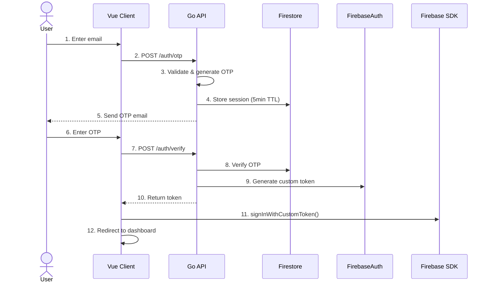

# Custom Authentication with Firebase

Passwordless OTP authentication system using Vue 3, Go, and Firebase. Full-stack monorepo with secure, user-friendly authentication flow.

## Overview

This project replaces traditional password-based authentication with a 6-digit OTP code sent via email, providing a more secure and user-friendly login experience.

### Key Features

- **Passwordless Authentication**: OTP-based login flow
- **Firebase Integration**: Authentication + Firestore
- **Development-Ready**: Firebase Emulator support with Docker Compose
- **Comprehensive Security**: Rate limiting, timing attack prevention, attempt restrictions

## Tech Stack

**Frontend** ([client_demo/](./client_demo/)):

- Vue 3.5 + TypeScript 5.9
- Vite 7.3, Vue Router 4
- Tailwind CSS 4.1 + DaisyUI 5.5
- Firebase SDK 12.7

**Backend** ([server/](./server/)):

- Go 1.25.5, Gin 1.11
- Firebase Admin SDK v4.18

**Infrastructure**:

- Docker + Docker Compose
- Firebase Emulator Suite

## Quick Start

### Prerequisites

- Go 1.21+
- Node.js 18+, pnpm
- Docker & Docker Compose

### Setup

**1. Clone repository:**

```bash
git clone https://github.com/OTakumi/custom_auth_with_firebase.git
cd custom_auth_with_firebase
```

**2. Start Firebase Emulator:**

```bash
docker compose up -d
```

Access: Emulator UI at <http://localhost:4000>

**3. Start backend:**

```bash
cd server
GOOGLE_CLOUD_PROJECT=demo-project \
FIRESTORE_EMULATOR_HOST=localhost:8080 \
FIREBASE_AUTH_EMULATOR_HOST=localhost:9099 \
go run ./cmd/api/main.go
```

API: <http://localhost:8000>

**4. Start frontend:**

```bash
cd client_demo
cp .env.example .env.local
# Edit .env.local with required variables (see client_demo/README.md)
pnpm install
pnpm dev
```

Client: <http://localhost:5173>

### Verify Setup

1. Open <http://localhost:5173>
2. Create account (signup mode)
3. Logout, switch to login mode
4. Enter email → request OTP
5. Check server console for OTP code
6. Enter OTP → redirect to dashboard

## Authentication Flow



**OTP Session**:

- Expiration: 5 minutes
- Max attempts: 3
- Format: 6-digit number
- Security: Constant-time comparison, IP hashing

## Project Structure

```
custom_auth_with_firebase/
├── client_demo/              # Vue 3 frontend
│   ├── src/
│   │   ├── components/auth/  # UI components
│   │   ├── composables/      # useAuthApi
│   │   ├── config/           # Firebase, API config
│   │   ├── pages/            # Login, Dashboard
│   │   └── router/           # Auth guards
│   └── README.md
│
├── server/                   # Go backend
│   ├── cmd/api/              # Entry point
│   ├── internal/
│   │   ├── domain/           # Entities, VOs
│   │   ├── usecase/          # Business logic
│   │   ├── infrastructure/   # Firebase, Firestore
│   │   └── interface/        # Handlers, middleware
│   └── README.md
│
├── firebase_emulator/        # Emulator config
├── docs/                     # Documentation
└── compose.yaml              # Docker Compose
```

See detailed documentation:

- [Frontend README](./client_demo/README.md)
- [Backend README](./server/README.md)

## API Endpoints

| Method | Endpoint | Description |
|--------|----------|-------------|
| `GET` | `/health` | Health check |
| `POST` | `/auth/otp` | Request OTP |
| `POST` | `/auth/verify` | Verify OTP, get token |

## Security

- **Timing Attack Prevention**: Constant-time OTP comparison
- **Email Enumeration Prevention**: Generic error messages
- **Brute Force Prevention**: 3 attempts + rate limiting (5 req/min)
- **OTP Security**: Secure random generation, 5-min expiration
- **IP Privacy**: SHA-256 hashing (GDPR compliant)
- **CORS**: Environment-based whitelist
