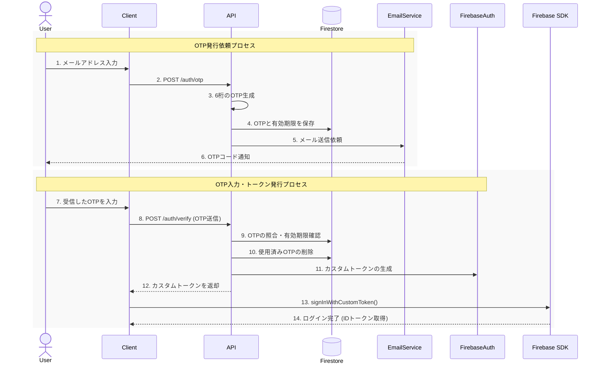

# Custom Authentication with Firebase

A backend service for a passwordless, one-time password (OTP) custom authentication flow using Go and Firebase.

## Overview

This project provides a secure and user-friendly alternative to traditional password-based logins. Instead of managing passwords, users receive a short-lived OTP to their email address, which they use to sign in. The backend is built with Go, using the Gin framework for the API and Firebase for custom token generation and OTP storage.

## Architecture

The service follows a layered architecture inspired by Clean Architecture principles, separating concerns into domain, usecase, infrastructure, and interface layers.

### Authentication Flow



## Getting Started

### Prerequisites

-   Go (version 1.21 or later)
-   Docker and Docker Compose

### Setup & Running

1.  **Clone the Repository:**
    ```bash
    git clone https://github.com/OTakumi/custom_auth_with_firebase.git
    cd custom_auth_with_firebase
    ```

2.  **Start Firebase Emulator:**
    This project is configured to work with the Firebase Emulator Suite. A `compose.yaml` is provided to run the emulators in Docker.
    ```bash
    docker compose up -d
    ```
    This will start the Firebase Emulator, including Firestore, Auth, and the Emulator UI.
    -   Emulator UI: `http://localhost:4000`
    -   Firestore Emulator: `localhost:8080`
    -   Auth Emulator: `localhost:9099`

3.  **Run the Application:**
    In the `server` directory, run the API server. You need to set the required environment variables.

    ```bash
    cd server
    GOOGLE_CLOUD_PROJECT=demo-project FIRESTORE_EMULATOR_HOST=localhost:8080 go run ./cmd/api/main.go
    ```
    The API server will start on `http://localhost:8000`.

### Running Tests

To run the integration tests, ensure the Firebase Emulator is running and execute the following command in the `server` directory:

```bash
FIRESTORE_EMULATOR_HOST=localhost:8080 go test -v ./tests/...
```

## API Endpoints

| Method | Endpoint         | Description                                        |
|--------|------------------|----------------------------------------------------|
| `GET`  | `/health`        | Checks the health of the API server.               |
| `POST` | `/auth/otp`      | Requests an OTP to be generated and sent to an email. |
| `POST` | `/auth/verify`   | (To be implemented) Verifies an OTP and returns a custom token. |

