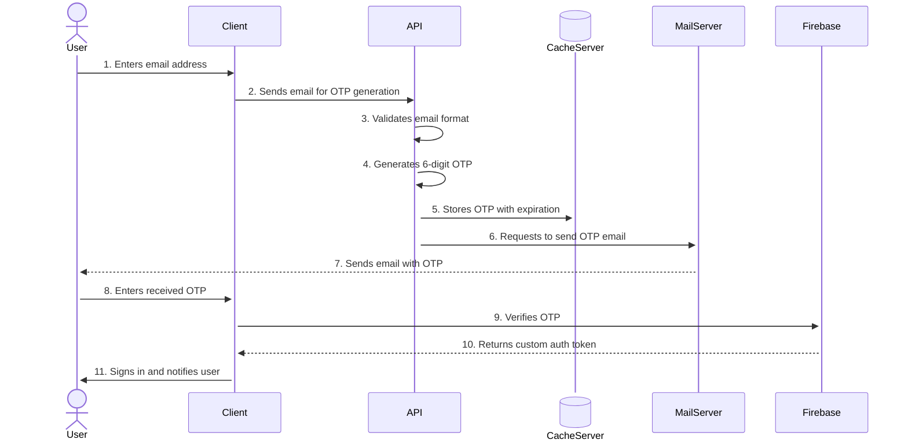

# Service Description: Firebase Custom Authentication with One-Time Passwords

This document outlines the architecture and flow of the custom authentication service implemented in this repository.

## Overview

The primary goal of this service is to provide a secure and user-friendly authentication system for applications using Firebase. It replaces traditional password-based logins with a one-time password (OTP) mechanism sent via email. This approach eliminates the need for users to manage passwords and enhances security by using short-lived tokens.

## Authentication Flow

The authentication process is designed to be simple for the user while maintaining a high level of security. The flow is as follows:

1. **Email Submission (Client-side):**
    - The user enters their email address into the login form on the client application.
    - The client application sends the email address to our backend API.

2. **OTP Generation and Delivery (API-side):**
    - The API receives the email address.
    - It first validates the format of the email address to ensure it is a valid email.
    - Upon successful validation, the API generates a secure 6-digit numerical one-time password (OTP).
    - This OTP is stored in a cache server (e.g., Redis) with a short expiration time.
    - The API then sends an email to the user's address containing the 6-digit OTP.

3. **OTP Verification and Login (Client-side & Firebase):**
    - The user receives the email and retrieves the 6-digit OTP.
    - The user enters this OTP into the login screen on the client application.
    - The client application sends the entered OTP to Firebase for verification.
    - Firebase validates the OTP. If it matches and is not expired, Firebase returns a custom authentication token to the client.
    - The client application uses this token to sign the user in.

## Security Benefits

- **Passwordless:** Users do not need to create or remember passwords, reducing the risk of password-related security breaches.
- **Short-lived OTPs:** The one-time passwords have a short validity period, minimizing the risk of them being compromised and reused.
- **Reduced Attack Surface:** Eliminates password reset and recovery flows, which can be a common vector for attacks.

## Sequence Diagram

